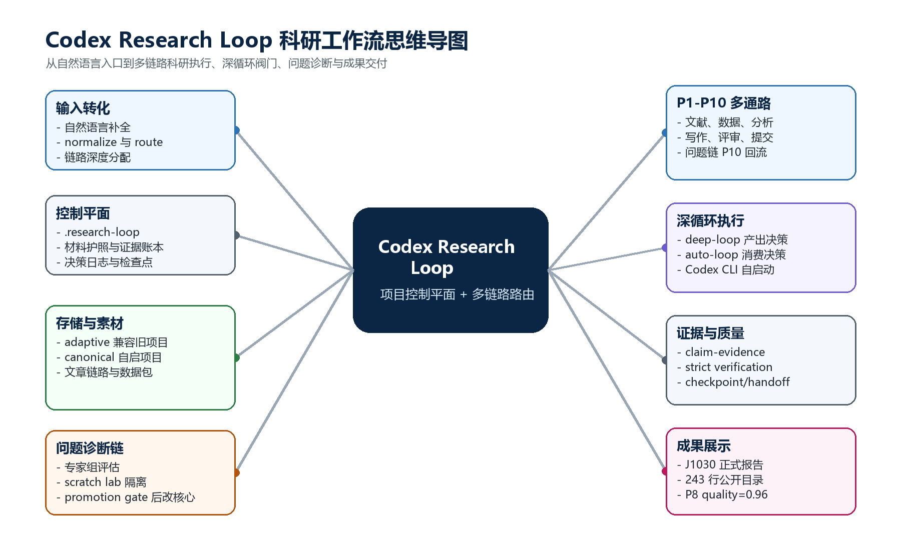
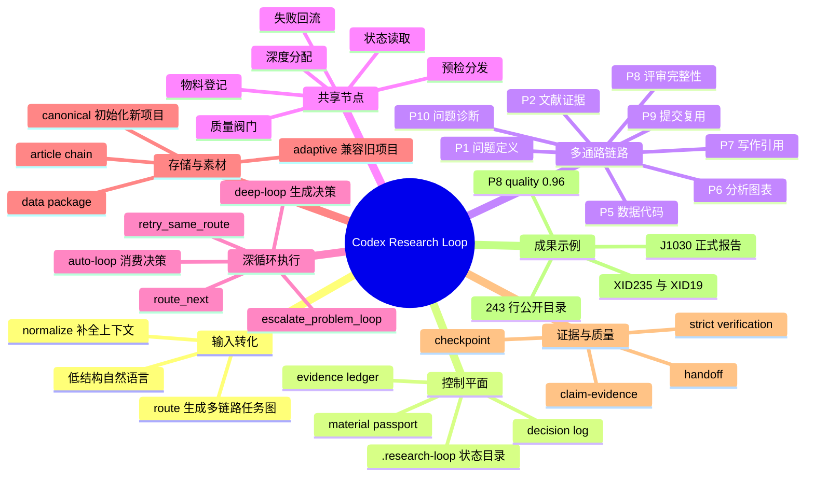
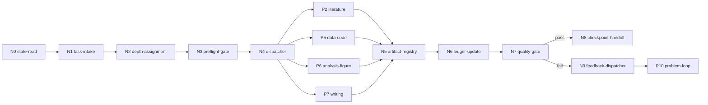

# Codex Research Loop 设计报告与 J1030 课题成果展示

报告日期：2026-07-11

插件名称：`codex-research-loop`
插件版本：`0.9.5+codex.20260711081523`
GitHub 仓库：`https://github.com/sum331/codex-research-loop`
成果课题：`J1030 Public-catalog Obscured AGN Candidate Search`

## 摘要

本报告总结 `Codex Research Loop` 的设计目标、架构、核心链路、深循环机制、无人值守执行方式和跨项目复用方法，并以 J1030 深场公开目录课题作为一次完整成果展示。该 loop 的定位不是单一自动化脚本，而是科研项目的控制平面：它把自然语言输入、项目状态、素材摄取、证据登记、链路路由、质量阀门、问题诊断和交付物管理统一进 `.research-loop/`。

在 J1030 课题中，loop 完成了从粗糙课题输入到正式科研报告的闭环：建立项目护照和存储规范，导入公开文献与目录材料，生成候选体分析表、图件和正式 DOCX 报告，并通过 P8 评审阀门。最终产物证明该系统能够支持真实科研任务，而不仅是流程设计。

## 1. 设计目标

`Codex Research Loop` 面向的是跨线程、跨项目、可长期运行的科研工作。它解决四类问题：

1. 用户输入通常是自然语言、低结构、缺少上下文，系统需要先补全为可执行工作提示。
2. 科研任务不是单链路，而是由文献、数据、方法、分析、写作、评审、发布、问题诊断等多条链路组成。
3. 长时间无人值守执行必须依赖明确阀门，而不是让代理无边界扩展。
4. 失败诊断和调整必须隔离在核心链路外，只有通过提升阀门后才能改动核心文件。

因此，loop 的设计原则是：项目状态本地化、材料和证据可追踪、路由多通路、深度可调、失败可回流、交付可验证。

## 2. 总体架构

### 2.1 思维导图

下图概括了 loop 的核心结构：自然语言输入先进入 normalize 与 route，随后由共享节点分发给 P1-P10 多条科研子链路；deep-loop 负责评估当前链路是否通过，auto-loop 负责消费该决策并继续无人值守执行；当项目出现阻碍时，P10 问题诊断链在隔离环境中生成专家评估和调整方案。





### 2.2 控制平面

每个项目都有独立的 `.research-loop/` 目录，记录项目状态、材料护照、证据账本、决策日志、运行日志、深循环报告、问题诊断案例、检查点和交接文件。它不直接替代研究材料本身，而是保存控制信息和审计信息。

### 2.3 插件组成

| 模块 | 实现入口 | 作用 |
| --- | --- | --- |
| 状态与护照 | .research-loop/state.json, material-passport.json | 跨线程保存课题、材料、主张、证据、风险、下一步 |
| 自然语言入口 | normalize | 把低结构输入转化为可执行 prompt、任务类型、链路深度和缺失槽位 |
| 多通路路由 | route, P1-P10, N0-N9 | 按科研阶段选择多个子链路，并让共享节点负责分发和回流 |
| 存储规范 | storage-policy | 在旧项目中自适应映射，在新项目中初始化 canonical 科研目录 |
| 素材摄取 | content-ingest, source-hub | 文章进入文章链路，数据进入标准数据包，来源元数据进入证据系统 |
| 证据阀门 | claim-evidence | 结构化检查 claim 与 evidence 的连接、来源、定位和状态 |
| 深循环阀门 | deep-loop | 产出 route_next, retry_same_route, escalate_problem_loop, pause_for_human |
| 无人值守执行 | auto-loop --auto-route-next | 把 deep-loop 决策交给执行器，触发下一链路或同链路重试 |
| 问题诊断链 | problem-loop, problem-promote | 在隔离 scratch lab 中生成专家组、测试和调整方案，过闸后才改核心文件 |
| 外部生态 | Zotero, llm-wiki, Codex CLI, MCP | 支持文献库、知识库、跨线程调用和自动代理启动 |

### 2.4 多链路科研流程

| 链路 | 名称 | 职责 |
| --- | --- | --- |
| P1 | scoping-question-chain | 问题定义、边界、研究目标 |
| P2 | literature-evidence-chain | 文献发现、文章摄取、证据记录 |
| P3 | claim-contribution-chain | 主张、贡献、创新性和证据对应 |
| P4 | method-experiment-compliance-chain | 方法设计、实验协议、合规检查 |
| P5 | data-code-execution-chain | 数据、代码、运行日志和复现 |
| P6 | analysis-statistics-figure-chain | 分析、统计、表格和图形 |
| P7 | writing-citation-format-chain | 写作、引用、DOCX/LaTeX/PDF |
| P8 | review-revision-integrity-chain | 评审、修订、完整性阀门 |
| P9 | submission-publication-reuse-chain | 提交包、发布、复用和后续种子 |
| P10 | problem-resolution-expert-chain | 阻碍诊断、专家组、隔离调整与提升 |

### 2.5 共享节点

系统在 P1-P10 子链路之外设置共享节点 N0-N9，包括状态读取、任务接收、深度分配、预检、分发、物料登记、账本更新、质量阀门、检查点交接和失败回流。这样可以避免把所有任务压进一条线性链路，也可以在失败后按问题类型回到合适子链路。



## 3. 深循环与无人值守机制

深循环由两层组成：

1. `deep-loop`：评估当前子链路是否通过，并输出 `route_next`、`retry_same_route`、`escalate_problem_loop` 或 `pause_for_human`。
2. `auto-loop --auto-route-next`：消费 `deep-loop` 决策，并真正启动下一子链路或同链路重试。

这一区分很关键。单独运行 `deep-loop` 只会生成路由指令，不会自动执行下一链路；无人值守运行必须由 `auto-loop` 接管。推荐命令形态为：

```powershell
python C:\Users\<User>\plugins\codex-research-loop\scripts\research_loop.py --cwd "D:\Project" auto-loop `
  --goal "finish current research stage" `
  --current-subchain P7 `
  --next-subchain P8 `
  --auto-route-next `
  --route-depth-budget 3 `
  --route-agent codex `
  --max-rounds 8
```

深循环不是越深越好，而是由任务难度、证据严格度、目标交付物和失败信号共同决定。课程报告类任务适合有限深循环：P5 数据复现、P6 分析图表、P7 写作引用、P8 评审完整性、P9 提交包收尾。真正需要长时间无人值守时，再开启更高的 `route-depth-budget`。

## 4. 问题诊断链设计

当项目出现阻碍时，loop 不直接修改核心文件，而是进入 P10：

1. 读取项目背景、状态、材料、路由图和现有日志。
2. 生成固定角色专家和现场构建专家，例如项目上下文分析师、测试验证工程师、隔离存储守护者、实现门禁评审员。
3. 在 `scratch/research-loop-labs/<case-id>/` 下保存诊断、测试和调整方案。
4. 通过 `problem-promote` 的提升阀门后，才允许把调整方案推广到主链路。

这一设计防止自动诊断污染主项目，尤其适合长周期科研项目和无人值守执行。

## 5. 安装与跨电脑复用

另一台电脑使用时，只需要克隆公开仓库，然后在目标项目中初始化：

```powershell
git clone https://github.com/sum331/codex-research-loop.git C:\Users\<User>\plugins\codex-research-loop
python C:\Users\<User>\plugins\codex-research-loop\scripts\research_loop.py --cwd "D:\Research\MyProject" init
python C:\Users\<User>\plugins\codex-research-loop\scripts\research_loop.py --cwd "D:\Research\MyProject" storage --style canonical --init-dirs --write
```

如果要迁移旧项目，应复制项目目录本身，并保留 `.research-loop/`。GitHub 仓库存放插件源码，不携带某个具体项目的私有材料和运行账本。

## 6. J1030 课题应用成果

### 6.1 课题定义

课题名称：`J1030 Public-catalog Obscured AGN Candidate Search`
研究领域：`X-ray astronomy; SMBH; obscured AGN`
目标场景：`X-SMBH course final project`
研究问题：`Can public J1030 catalog data alone identify a physically meaningful subset of heavily obscured AGN candidates, and does XID361 naturally appear as an X-ray-underluminous high-priority source?`

### 6.2 执行链路

该课题经历了以下关键阶段：

1. P1/P2：根据课程大纲和课题草案，明确公开目录 AGN 候选体筛选问题，并登记文献元数据。
2. P5：构建 J1030 公开目录数据包、处理有效 VizieR 表格、隔离无效 bot-check 下载。
3. P6：生成 243 行 master candidate table、候选排序表和正式图件。
4. P7：形成正式科研报告 Markdown 与 DOCX。
5. P8：通过正式评审阀门，质量分数 0.96，决策为 `route_next`。

### 6.3 关键量化结果

| 指标 | 结果 |
| --- | --- |
| 公开目录总源数 | 243 |
| 带光谱性质的源 | 243 |
| 光谱或高可信红移 | 134 |
| AGN-like 源 | 99 |
| obscured 候选 | 154 |
| heavily obscured 候选 | 71 |
| Compton-thick 量级候选 | 3 |
| XID361 状态 | 存在；低 X-ray luminosity NL-AGN 基准源，但目录 NH 不支持直接列为 heavily obscured |
| P8 阀门 | route_next; quality_score=0.96 |

### 6.4 高优先级候选体展示

| 候选体 | 分数 | 类别 | 红移 | 光谱类型 | log NH | log L2-10 |
| --- | --- | --- | --- | --- | --- | --- |
| XID235 | 5 | heavily_obscured | 0.8249 | NL-AGN | 23.31 | 43.01 |
| XID19 | 5 | heavily_obscured | 0.9378 | NL-AGN | 23.09 | 43.11 |
| XID189 | 4 | ct_level_nh | 1.699 | NL-AGN | 24.18 | 44.21 |
| XID95 | 4 | heavily_obscured | 2.508 | Hiz-LAE | 23.36 | 44.00 |
| XID186 | 4 | heavily_obscured_uncertain | 1.943 | BL-AGN | 23.28 | 43.98 |

### 6.5 产物清单

主要产物包括：

- 正式报告 DOCX：`$env:J1030_PROJECT_ROOT\reports\j1030_formal_research_report.docx`
- 正式报告 Markdown：`$env:J1030_PROJECT_ROOT\reports\j1030_formal_research_report.md`
- Word 导出 QA PDF：`$env:J1030_PROJECT_ROOT\reports\j1030_formal_research_report_word_export.pdf`
- master candidate table：`$env:J1030_PROJECT_ROOT\data\processed\j1030_master_candidate_table.csv`
- top20 candidate table：`$env:J1030_PROJECT_ROOT\outputs\tables\top20_obscured_agn_candidates.csv`
- all ranked candidate table：`$env:J1030_PROJECT_ROOT\outputs\tables\all_ranked_obscured_agn_candidates.csv`
- 正式图件：`$env:J1030_PROJECT_ROOT\outputs\figures\formal\fig1_formal_logL210_vs_redshift.png`, `$env:J1030_PROJECT_ROOT\outputs\figures\formal\fig2_formal_logNH_vs_redshift.png`, `$env:J1030_PROJECT_ROOT\outputs\figures\formal\fig3_formal_logNH_distribution.png`

### 6.6 科研结论展示

J1030 课题证明：公开目录可以构建有物理意义的重度遮蔽 AGN 候选池。XID235 与 XID19 是最稳健的高优先级候选，XID189 是 Compton-thick 量级 NH 候选。XID361 被恢复为 X-ray-underluminous NL-AGN 基准源，但仅凭目录 NH 不能将其列为重度遮蔽确认源，因此更适合作为多波段不匹配诊断的基准对象。

## 7. 设计复盘

这轮真实课题运行暴露出一个重要工程边界：`deep-loop` 与 `auto-loop` 必须明确分层。`deep-loop` 负责评估和生成下一链路指令；`auto-loop --auto-route-next` 才负责消费该指令并继续执行。如果用户期望无人值守深循环，入口命令必须包含自动路由执行器。

这一问题反而完善了系统设计：之后应在项目 profile 中加入运行模式，例如 `delivery_mode`、`unattended_mode` 和 `terminal_stage_policy`。当任务是交付型报告时，P8/P9 通过后可以停止；当任务是探索型科研时，可以继续进入更深链路。

## 8. 后续增强方向

1. `repository-publisher`：支持 Zenodo/OSF 发布、DOI 回填和 release provenance。
2. `research-kg-builder`：把论文、主张、证据、数据、运行、图件和决策构成知识图谱。
3. `experiment-runner-plus`：记录环境哈希、资源消耗、批处理任务和失败重试策略。
4. `literature-monitor`：定期监控新论文、引用和竞争结果。
5. `semantic claim verifier`：在结构性证据检查之外，加入语义级证据支持判断。

## 9. 结论

`Codex Research Loop` 已经从一个局部 loop 升级为可跨项目复用的科研工作流插件。它的核心价值不是替代专业研究技能，而是把专业技能组织进一个可追踪、可验证、可恢复、可无人值守推进的控制系统。J1030 课题展示了该设计在真实科研课程项目中的可用性：从自然语言任务到数据处理、图表、正式报告和评审阀门，形成了完整闭环。
